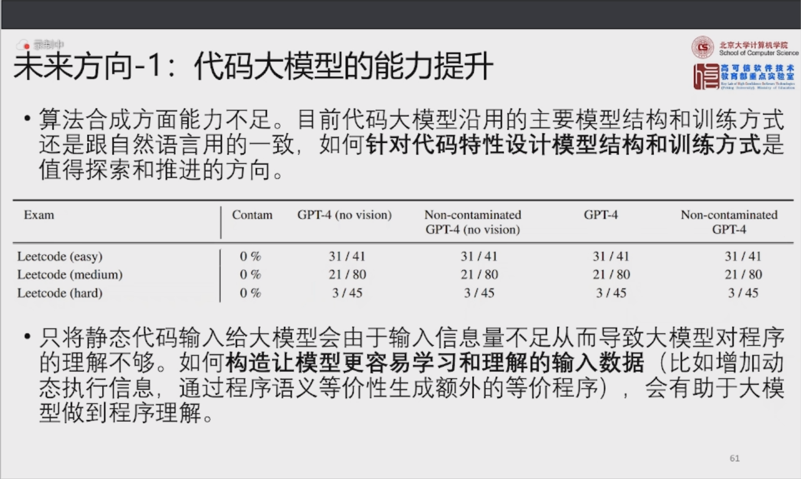
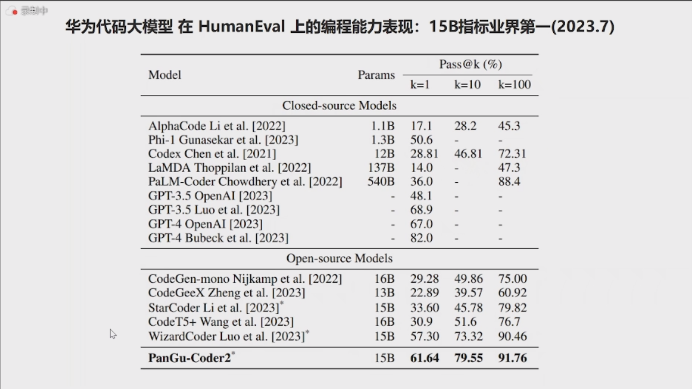
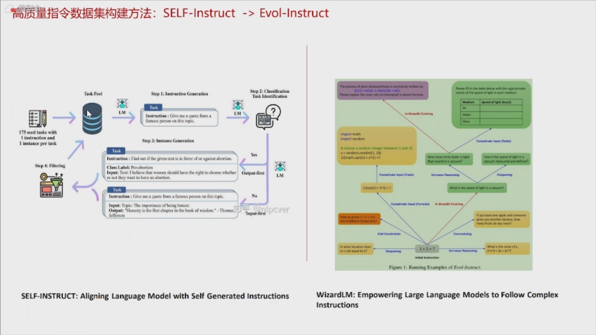
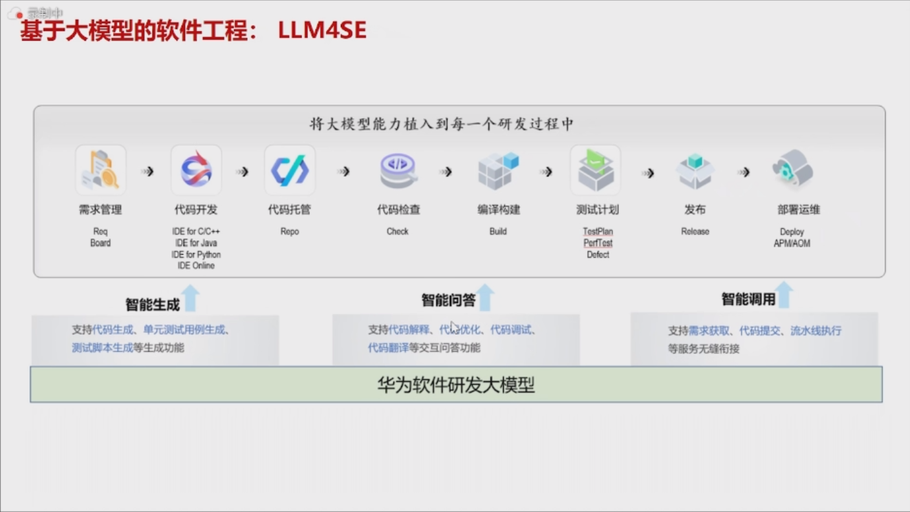

# 2023 ADL

[toc]

## 专题讲座1：基于大模型的代码生成：趋势和挑战
谢涛  北京大学讲席教授，计算机学院软件科学与工程系主任，高可信软件技术教育部重点实验室副主任

[ml4code](https://ml4code.github.io) 一个记录机器学习在大代码上的研究应用的网站

软件解析学：分析软件系统质量、软件用户体验、软件开发过程生产力
MSR：Mining software repository

软件研发数据：
 - 开发：源代码、Bug历史、测试用例、检查历史、开发者在开发过程中的视觉跟踪、脑电波MRI/EMG
 - 用户：使用日志、用户调研、在线论坛评论、blog & twitter
 - 系统：运行日志、系统事件等

## 专题讲座2：大模型时代的软件研发：范式与工具
王千祥 华为公司PaaS技术创新实验室主任

AI编程的两个挑战：程序空间很大、用户意图不明

代码大模型演变

Hugging Face 大模型仓库