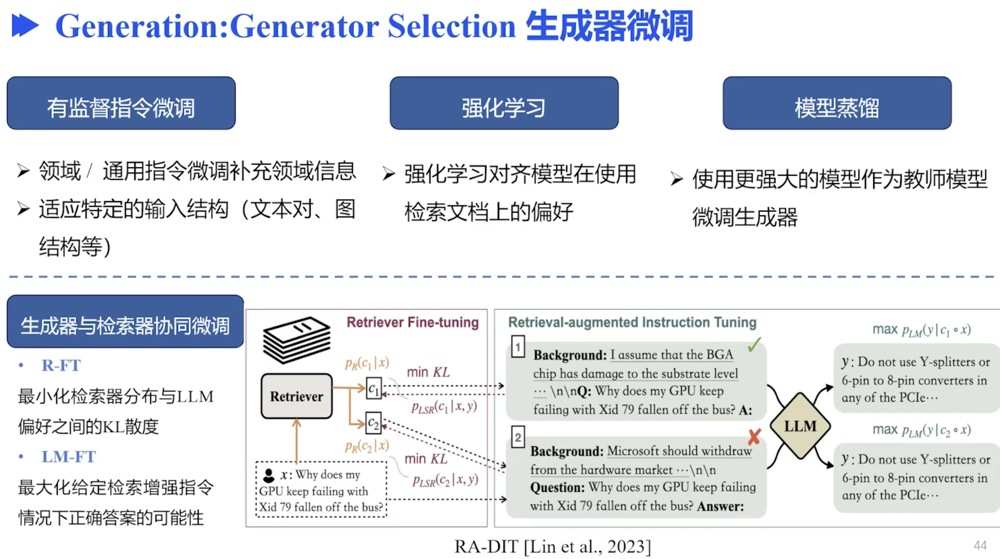
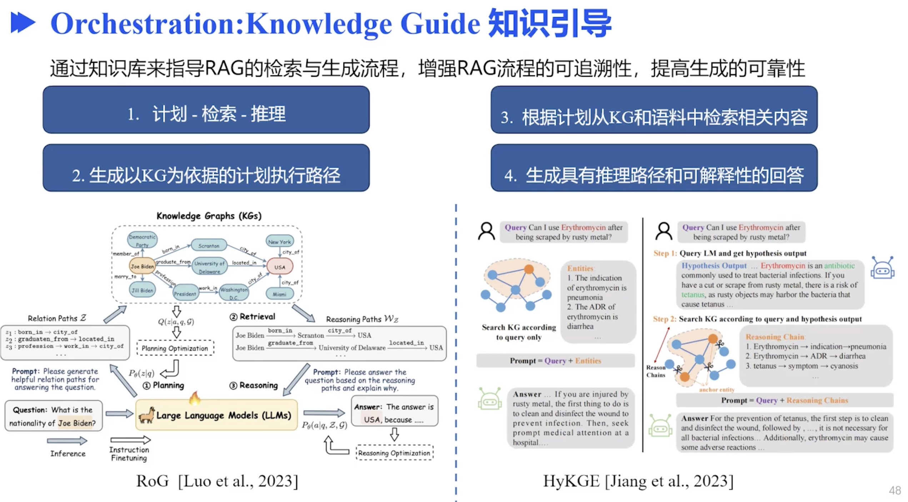
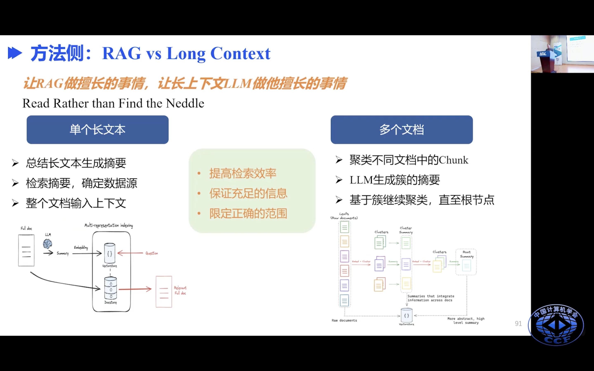

RAG的3个阶段

针对输出作修改，在beamseach的时候，有k个候选句子，让它们和检索内容做分数计算，取高的。或者修改损失函数

- 只检索diff中的变更部分，会不会有性能提升
- AST检索，会不会有性能提升
- 训练集对msg进行序列模式提取，将其作为特征加入到输入一起训练微调，是否能提升效果？新来1个msg先对其进行sp分类，然后将其作为输入
- BM25检索出来的东西放到Input究竟对模型会不会有提升

