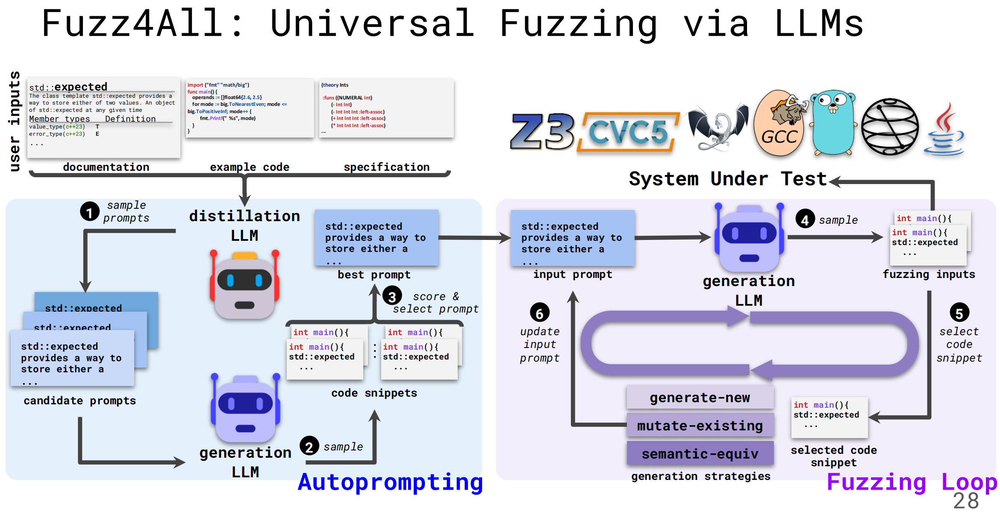

[toc]

## 测试分类

- 黑盒测试。只测试产品的功能是否满足要求，而不需要了解程序的内部逻辑，常见于系统测试阶段。
- 灰盒测试。介于黑盒测试和白盒测试之间，测试者有限地了解软件的内部结构和逻辑。
- 白盒测试。测试者需要完全了解程序的内部逻辑结构和代码实现。

## Fuzz testing/Fuzzing

Definition: Automatically generate inputs/tests for a system to discover potential bugs and vulnerabilities

模糊测试，通过生成一些数据注入到系统中来识别潜在的安全漏洞或功能缺陷。

### 分类：

`变异测试（mutation-based）`、`生成测试（generation-based）`、`基于大模型的（llm-based）`

|                  | 定义                           | 优点          | 缺点 |
| ---------------- | ------------------------------ | ------------- | ---- |
| generation-based | 基于预定义的结构和语法生成输入 | 1.高度定制 2.能够深入测试特定功能和边界条件  | 1.需要手工设计，实现成本高 2.生成的能力有限 |
| mutation-based   | 对高质量的种子输入应用小的突变 | 1.快速部署 2.能发现意外错误 | 1.需要手工设计 2.依赖高质量的种子和变异模式 |
| LLM-based |                                |               |      |

模糊测试工具：

- AFL
- LibFuzzer
- [OSS-Fuzz](https://github.com/google/oss-fuzz)

### LLM-based fuzzing

对Deep Learning Library 进行Fuzzing

**挑战:**

- 需要处理Python的符号和语义 

- 复杂的张量计算约束

- 其它隐式或显式的API约束

已有方法：

- **API-level:** FreeFuzz, DocTer, DeepREL, NablaFuzz, ...
- **Model-level:** CRADLE, LEMON, Muffin, NNSmith, NeuRI...

动机:

大模型基于大量代码语料训练，因此能够生成多样化和有效的程序用于Fuzz

- 生成式LLM提供种子程序，如Codex
- 填充式LLM变异程序，如InCoder

TitanFuzz：

第一个基于LLM的用于fuzz DL library的方法

``Deng, Yinlin, et al. "Large language models are zero-shot fuzzers: Fuzzing deep-learning libraries via large language models." *Proceedings of the 32nd ACM SIGSOFT international symposium on software testing and analysis*. 2023.``

如何发现更多bug？我们能否利用LLM来直接生成更有可能触发bug的不寻常程序？

FuzzGPT：

``Deng, Yinlin, et al. "Large language models are edge-case fuzzers: Testing deep learning libraries via fuzzgpt." *arXiv preprint arXiv:2304.02014* (2023).``

TitanFuzz和FuzzGPT可以泛化到不同的系统，但输入必须要任意形式，且不同系统的prompt也不同。如何减少基于LLM的Fuzz的手动prompt工作？

Fuzz4All:

``Xia, Chunqiu Steven, et al. "Universal fuzzing via large language models." *arXiv preprint arXiv:2308.04748* (2023).``

参考资料：

[1]: https://xiongyingfei.github.io/SA/2017/main.htm	"北大熊英飞教授《软件分析技术》课程"
[2]: https://space.bilibili.com/2919428/channel/series "南京大学《软件分析》课程"
[3]: https%3A//cs.au.dk/~amoeller/spa/ "国外课件"
[4]: https://www.zhihu.com/question/388240608/answer/1157919593 "入门"
