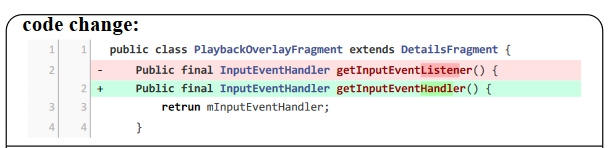

# CMG方法复现

SOTA方法在数据集上的表现汇总：


## NNGen

给定`query diff`，将其和训练集中的所有`diff`变成词袋模型（Bag of Words）向量，通过计算`query diff`向量和其它向量的余弦相似度，找到最相似的top-k个commits对应的`messages`，再把`query diff`和这些`messages`计算BLEU分数，选择最高的作为检索结果。

## COME

2023年ISSTA上的一篇文章。该方法的主要动机是代码变更应该要突出变更的部分，已有方法要么将代码变更序列全部考虑，要么视为结构复杂的抽象语法树。这篇文章的核心创新点在于提出了一种对代码变更进行嵌入表示的方法——利用编辑距离算法计算而来。其次，附带了两个方法：自监督的生成任务和结合检索方法的决策算法。在复现过程中，这两个附带方法对指标的提升效果不大。下面主要详解嵌入模块的实现方法：


如图所示，首先找到add和delete代码token的位置，对于add的tokens，使用tag=2进行标记。对于delete的tokens，使用tag=1进行标记，而对于没有变动的token，使用tag=0进行标记。最后得到代码token和tag两个向量：$source\_ids$和$tag\_ids$。在模型的训练阶段，$source\_ids$和$tag\_ids$​会作为模型的输入：

```python
# run_gen.py -> main()

elif args.data_type == 's1' or args.data_type == 's2':
    outputs = model(input_ids=source_ids, tag_ids=tag, attention_mask=source_mask,
                    labels=target_ids, decoder_attention_mask=target_mask)
    loss = outputs.loss
```

论文的源码实现里，模型类`EdistT5`继承自transformers的`T5ForConditionalGeneration`，采用的Encoder类`EdistT5Stack`继承自transformers的`T5Stack`。由于T5采用的是`seq2seq`的架构，因此Encoder的输入和模型的输入一致，也包含$source\_ids$和$tag\_ids$。在Encoder类`EdistT5Stack`的forward函数里面，$source\_ids$和$tag\_ids$分别通过一个Embedding层变成嵌入向量$E_r=rW_r$和$E_t=tW_t$，$W_r$和$W_t$就是Embedding层要学习的参数。最后，$E_r$和$E_t$会进行相加得到最后的输入嵌入：$inputs\_embeds$

```python
# EdistT5 -> EdistT5Stack -> forward
if inputs_embeds is None:
        assert self.embed_tokens is not None, "You have to initialize the model with valid token embeddings"
        if self.tag_emb is not None and tag_ids is not None:
            inputs_embeds = self.embed_tokens(input_ids) + self.tag_emb(tag_ids)
        else:
            inputs_embeds = self.embed_tokens(input_ids)
```

两个嵌入向量的维度大小：

```
self.tag_emb = nn.Embedding(4, config.d_model) # 4 * 512
self.shared = nn.Embedding(config.vocab_size, config.d_model) # 32128 * 512
```

### 如何得到$source\_ids$和$tag\_ids$

1. 首先数据集分为`train.jsonl`、`valid.jsonl`、`valid.jsonl`，3个文件的每一行数据样例格式是一样的。每一行包括`code_tokens`和`docstring_tokens`，分别对应diff和message。这两个tokens序列是已经分好词的序列，为保证序列的一致性，论文对序列多余的空白和换行符进行了处理，这里最后得到的是一个example类，即包含diff和message。

```
code = ' '.join(js['code_tokens']).replace('\n', ' ')
code = ' '.join(code.strip().split())
nl = ' '.join(js['docstring_tokens']).replace('\n', '')
nl = ' '.join(nl.strip().split())
Example(
                    idx=idx,
                    source=code,
                    target=nl,
)

```

2. 将example转化为特征。对于diff序列，首先根据`<nl>`token将其分成长度为行数的数组，目标是得到最后的$source\_ids$和$tag\_ids$，核心算法如下：

```python
def gen_edist(diff, tokenizer, max_len):
    """
    input:
    diff - split by '<nl> ' 按行划分的数组
    output:
    diff_out - split by ' ' diff的token序列
    tag - diff_out token tag tag的token序列
    """
    diff_out, tag = [], []
    i = 0
    while i < len(diff): # 遍历每一行
        # 如果这一行没有token，下一行
        if len(diff[i]) == 0:
            i += 1
            continue
        # 如果碰到‘-’开始的行，说明是删除的行
        if diff[i][0] == '-':
            del_list, add_list = [], []
            # 找到连续的‘-’开始的行，并把这些行里面的单词使用tokenizer进行token化
            while i < len(diff) and diff[i][0] == '-':
                diff_token = diff[i].split()[1:]
                diff_token = " ".join(diff_token)
                diff_token += " <nl>"
                output = tokenizer.encode(diff_token)
                del_list += output[1:-1] # 这里没考虑开始token的第一个和最后一个token，也就是去除了首尾标记
                i += 1
                while i < len(diff) and len(diff[i]) == 0:
                    i += 1
            # 同样的，找到连续的‘-’开始的行，并把这些行里面的单词使用tokenizer进行token化
            while i < len(diff) and diff[i][0] == '+':
                diff_token = diff[i].split()[1:]
                diff_token = " ".join(diff_token)
                diff_token += " <nl>"
                output = tokenizer.encode(diff_token)
                add_list += output[1:-1]
                i += 1
                while i < len(diff) and len(diff[i]) == 0:
                    i += 1
            # 如果没有添加的行，那就只把删除的行的token放到最后结果里，对应的tag都为1
            if len(add_list) == 0:
                # only delete
                diff_out += del_list
                tag += [1] * len(del_list)
            # 否则，将删除的行和添加的行使用编辑距离算法计算，把计算结果放到最后的结果里
        	else:
                res_token, res_tag = calcu_edit_distance(del_list, add_list)
                diff_out += res_token
                tag += res_tag
        # 如果碰到“+”开始的行，只把添加的行里的token放到最后结果里，对应的tag都为2
    	elif diff[i][0] == '+':
            # only add
            diff_token = diff[i].split()[1:]
            diff_token = " ".join(diff_token)
            diff_token += " <nl>"
            output = tokenizer.encode(diff_token)
            diff_out += output[1:-1]
            tag += [2] * len(output[1:-1])
            i += 1
        # 没+也没-，把这些token放到最后结果里，对应的tag都为0
    	else:
            # only origin
            diff_token = diff[i] + " <nl>"
            output = tokenizer.encode(diff_token)
            diff_out += output[1:-1]
            tag += [0] * len(output[1:-1])
            i += 1
        # 超过最大长度了，后面没必要处理
        if len(diff_out) > max_len:
            break
    return diff_out, tag
```

算法的核心是基于一个数据事实：计算编辑距离针对的是既有删除又有增加的行，在diff里面，都是先以`-`开头，再以`+`开头。如下：



编辑距离的计算：

```python
def calcu_edit_distance(del_token, add_token):
    ''' What operation did del_token become add_token through '''

    m = len(del_token)
    n = len(add_token)
    dp = [[0] * (n + 1) for _ in range(m + 1)]

    for i in range(1, m + 1):
        dp[i][0] = i

    for j in range(1, n + 1):
        dp[0][j] = j

    for i in range(1, m + 1):
        for j in range(1, n + 1):
            if del_token[i - 1] == add_token[j - 1]:
                dp[i][j] = dp[i - 1][j - 1]
            else:
                dp[i][j] = min(dp[i - 1][j - 1], dp[i - 1][j], dp[i][j - 1]) + 1

    i = len(dp) - 1
    j = len(dp[0]) - 1
    res = []
    while i > 0 or j > 0:
        a = dp[i - 1][j - 1] if i > 0 and j > 0 else float("inf")
        b = dp[i - 1][j] if i > 0 else float("inf")
        c = dp[i][j - 1] if j > 0 else float("inf")
        min_val = min([a, b, c])

        if dp[i][j] == a and a == min_val:
            i -= 1
            j -= 1
            assert del_token[i] == add_token[j]
            res.append((del_token[i], 0)) # ori
        elif a == min([a, b, c]):
            i -= 1
            j -= 1
            res.append((add_token[j], 2)) # add
            res.append((del_token[i], 1)) # del
        elif b == min([a, b, c]):
            i = i - 1
            res.append((del_token[i], 1)) # del
        else:
            j = j - 1
            res.append((add_token[j], 2)) # add
    res = res[::-1]
    res_token = [r[0] for r in res]
    res_tag =  [r[1] for r in res]
    return res_token, res_tag
```


