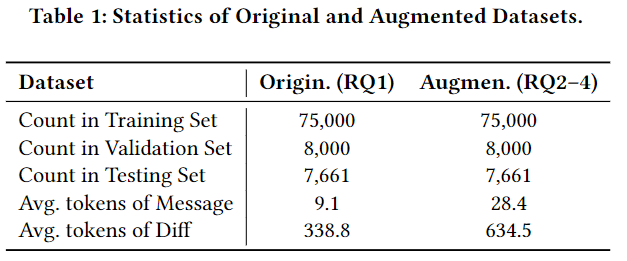
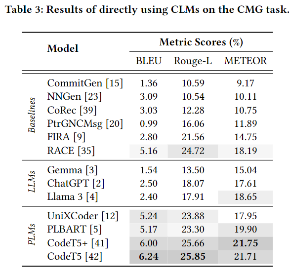

## RAG-Enhanced Commit Message Generation

### 贡献

- 将检索增强用于CMG任务
- 充分比较了多种预训练模型以及大模型使用检索增强后的效果

### 方法

数据集用的是`CodiSum`，包含75000个训练样本，7661个测试样本

### 检索部分

检索方法使用了`BM25`、`CodeT5+`的encoder（256维），并将两种方法的分数按`1:1`进行加权来实现混合检索。检索库用的`CommitBench`中160万条commit，为了防止数据泄露，如果检索到和`query diff`一模一样的，则选择分数第二的commit。

### 增强部分

对于PLM，增加了3个special tokens：`[QUERY]`,`[DIFF]`,`[MSG]`

对于LLM，使用的prompt为：

## 结果

使用的大模型：

不使用RAG：

使用RAG：

检索方法：

