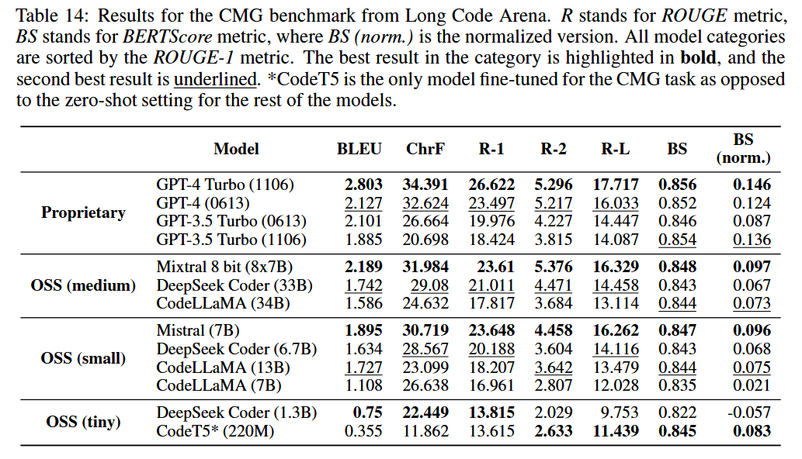

# CMG

## 1. Long code context

### Limitation: 

In CMG, a model should generate a natural language description of changes performed in a single commit. The changes can be represented in different ways --- in various diff formats, as seperate versions of each file before and after the changes took place, and others.  Moreover, models can utilize information from unchanged project files to better understand how changes impacted the project. **However, researchers often limit the scope to short diffs[1], leaving the performance on larger commits unexplored.**

### Benchmark & baselines

Dataset: A sample from CommitChronicle that contains 163 commits from 34 repositories.

Metrics: BLEU, ROUGE, ChrF, and BERTScore.

Baselines: Mixtral-8x7B, Mixtral-7B, DeepSeek Coder, CodeLLaMA, fine-tuned CodeT5.

[1] From commit message generation to history-aware commit message completion.

## TODO:

- 确认已有数据集是否是多文件的
- 复现已有模型
- CCT5复现：下载数据、复现

