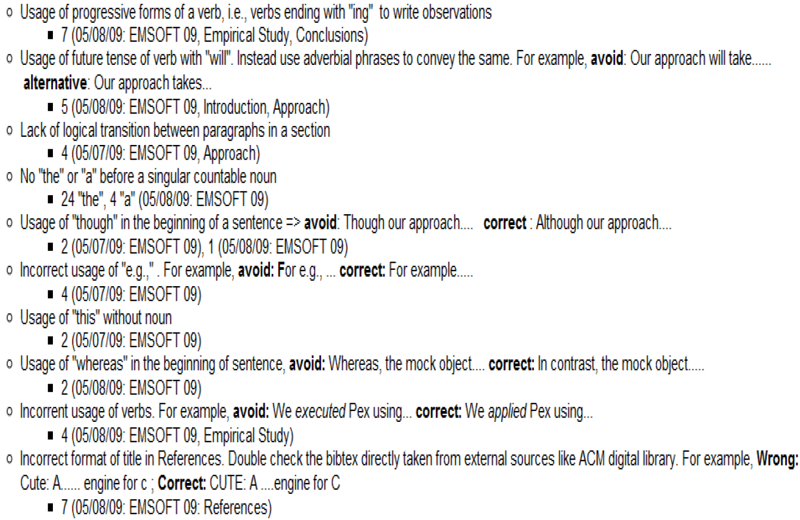

# 常见写作问题

---

内容主要来源：北京大学谢涛教授PPT《Common Technical Writing Issues》

## 写作主要目标

- 不要让读者在阅读你的论文时感到吃力  
- 文章的技术内容本来就已经足够难了

---

## 自顶向下的写作风格

- 以自顶向下的方式引导读者阅读你的论文
  - 先告诉读者你将要讲述内容的结构（总分）
- 参见我的博客文章《Advice to Students on Mastering Communication Skills》
  - http://asegrp.blogspot.com/2009/11/advice-to-students-on-mastering.html
- 《金字塔原理（The Minto Pyramid Principle）》
  - http://www.barbaraminto.com/textbook.html

---

## 避免含糊不清的词

- `since` → `because`
  - 反例：components may become coupled since the adaptation introduces dependency.  
- `while` → `although`、`whereas`
- `method` → `technique`、`approach`
- `function` → `functionality`
- `if` → `whether`
- “test” a question/hypothesis → 用 `answer` 或 `validate`

---

## 避免过于绝对的词

- `always` → `often`
  - 反例：Coupling is always regarded as a fatal factor for reducing maintainability.  

---

## 避免非正式或冒犯性的词

- 避免使用 `obviously`、`clearly`、`apparently`
- 避免使用 `very`？
- `Though` → `Although`
- `above` → `preceding`
- `very well` → `satisfactorily`、`sufficiently`
- `enough` → `sufficient`
- `as far as we know` → `within our knowledge`
- `means` → `indicates`、`represents`

---

## 避免复杂词汇

- `utilize` → `use`

---

## 把意思明确写出来

- 不要让读者去猜
- 例子：I just got a pet and gave her a name. This is cute.
  - 是这只宠物很可爱？
  - 是这个名字很可爱？
  - 是获得宠物的过程很可爱？
  - 还是起名这个过程很可爱？
- 检查你的写作中是否有 `This is`、`It is`、`They are`、`This does` 等表达；  
  在 `this` 或 `that` 后面补上名词，并尽量把 `they` 等代词替换为明确的名词。
- 反例：The solution in Fig. 2 is in fact a graph production. It follows the definition and presents a software transformation rule.

---

## `Which` 和 `That`

- 限定性从句：用 `that`（前面不加逗号）
- 非限定性从句：用 `which`（前面加逗号）
- `ABC which is the best one`
  - 可以改成：`ABC, which is the best one`
  - 或：`ABC that is the best one`

---

## 关于 `Which` 的更多说明

- 不要用 `which` 指代整个句子
  - 反例：We verify the applications implemented by application developers, which helps to discover problems in application systems.
  - 正例：We verify the applications implemented by application developers; the verification helps to discover problems in application systems.
- 不要让 `which` 和它所修饰的名词之间隔着一些短语
  - 反例：Spin provides extension mechanisms such as embedded C code, which greatly facilitate the transformation
  - 正例：… mechanisms (such as embedded C code), which …

---

## Figure 1、Table 1、Section 1 等写法

- 前面不需要加 `the`
- 首字母需要大写
- 不需要写成 Figure one、Table one 等
- 可以引用多个编号，如 `Figures 1-3`、`Tables 1 and 6`；记得使用复数形式
- 另一种写法（不常见，也不够简洁）：the first figure、the first table
- 其他类似表达：Transaction A、Account B

---

## Also、And、Further

- 不要在句首写 `And`
  - 直接删掉即可
- 不要在句首写 `Also,`
  - 可改用 `In addition,` 或 `Additionally`
  - 或把 `also` 放在句中
  - 反例：Also we implemented a tool…
  - 正例：We also implemented a tool

---

## 保证一致性

- 用词要保持一致
- 例如：
  - We conducted an experiment to do ….
  - This evaluation does provide insights…
  - 应把 `evaluation` 改成 `experiment`
- 反例：
  - Section 1 introduces….Section 2 gives …We also give an example in Section 3. Finally, we explain .. In Section 4.
- 正例：
  - … Section 3 gives an example. Finally Section 4 explains…

---

## 主语错误（Dangling modifiers）

- 反例：After reading the original study, the paper remains unconvincing.
  - 改为：After …, we find that the paper …
- 反例：The experiment was a failure, not having studies the lab manual.
  - 改为：They failed in their experiment, not …
- 反例：To improve his approach, the experiment was done.
  - 改为：To improve his approach, he did the experiment.
- 反例：To capture the new semantics, Promela is extended with new primitives.
  - 改为：To capture the new semantics, we extend Promela …

---

## 句子太长

- 反例：  
  In ABC, the Project Plan module responsible for making plan can access the Process Pattern Manager, which can choose proper process patterns from Process Pattern Base, utilize the value of estimated parameter vector in quantitive context models to assist the estimation in project plan, and build project plan skeleton based on the solution part of selected process patterns.
- 正例：把 `, which can` 改成 `. This manager can`

---

## 标点问题

- 当列举三个以上项目时，在 `and` 前加逗号  
  - `A, B and C` → `A, B, and C`
- `or` 也一样
- 在 `e.g.`、`i.e.` 后面加逗号
- 在 `respectively` 前面加逗号

---

## 引用

- 不要把 `[1]` 直接当作句子的一部分
  - 去掉 `[1]` 后，句子不应残缺不全
  - `Tools proposed in [2]` → `Tools proposed by AAA et al. [2]`
- 提到他人工作时：
  - 两位作者：A and B [1] proposed …
    - 例如：Xie and Notkin [1] proposed
  - 两位以上作者：A et al. [2] proposed …
    - 例如：Xie et al. [2] proposed
- 不要用全名，只用姓
- 反例：Tao Xie et al. [1]
- 在 `[1]` 前加一个空格

- 不要使用带情绪色彩的词
  - 反例：Xie et al. [1] developed an excellent tool
  - 反例：JPF [2] is a famous model checker
  - 或许可以：JPF [2] is a well-known model checker

---

## 不可数名词

- 当 `work` 表示研究工作时，不可数
- `research` 也是不可数
- `software` 也是不可数
- 反例：several works, several researches, several softwares
- 正例：
  - several research projects
  - several pieces of work
  - several lines of research
  - several software programs
  - several software applications

---

## 缩写

- 先写全称，再写 `（缩写）`
- 记得在 `(` 前面加空格
- 最好把相关单词首字母大写
  - 反例：CBSE(Component-based software engineering)
  - 正例：Component-Based Software Engineering (CBSE)

---

## 用 `A` 还是 `An`？

- `A FSM` → `An FSM`
- `a XML file` → `an XML file`
- `a L and a R` → `an L and an R`

---

## `Only`

- 注意 `only` 的位置
- 反例：JPF only interprets Java bytecode and cannot support native code
  - 问题在于：这里像是在说“只解释”，而不是“不会编译”？
- 正例：JPF interprets only Java bytecode and cannot support native code

---

## `Will`

- 通常尽量避免使用 `will`，而改用 `plan to`、`shall` 或 `does`
  - 但在 proposal 中使用 `will` 可能是可以的
- 反例：Our future work will focus on …
- 正例：In future work, we plan to focus on …
- 反例：Section 5 will describe the experiment
- 正例：Section 5 describes the experiment

---

## 避免 firstly、secondly 等

- 除了 `finally` 外，`first`、`second`、`third` 等后面不要加 `ly`
- 用 `First`、`Second`、`Third`、`Finally`

---

## 避免被动语态

- 使用被动语态会让“主语”不清楚
- 反例：  
  Given the collected operational violations, a Perl script was developed to select the first encountered test for each violated operational abstraction. Then the selected violating tests are sorted based on the number of their violated operational abstractions.

- 正例：  
  Given the collected operational violations, Jov selects the first encountered test for each violated operational abstraction. Then Jov sorts the selected violating tests based on the number of their violated operational abstractions.

---

## 冠词使用

- 如果一个名词是可数的（且为单数），前面必须有 `a`、`the` 或类似 `my` 这样的限定词
- 你也可以把单数改成复数来修正
- 何时用 `a` 或复数，何时用 `the`，要特别注意
- 反例：following definition defines …
- 正例：the following definition defines
- 反例：In model checker Spin
- 正例：In the Spin model checker

---

## `Otherwise`

- `Otherwise` 不能直接连接两个分句
- `A, otherwise, B` → `A; otherwise, B`
- `however`、`therefore` 也有类似规则
- 也可以把 `;` 换成 `.`，并把后一句首字母大写

---

## 不要写 `can not`，避免缩写 `n't`

- `can not` → `cannot`
- `don’t` → `do not`

---

## `The authors`

- 更好用 `We`
- 反例：The authors also extract many requirements…
- 正例：We also extract many requirements
- 但在致谢中这样写可能没问题
  - 可以：the authors would like to thank …
- 旁注：在美式英语中写作 `acknowledgment`，英式英语中常写 `acknowledgement`

---

## 长主语

- 反例：An example taken from middleware enabled systems demonstrates the feasibility and effectiveness of our approach
- 正例：We demonstrate the feasibility and effectiveness of our approach with an example taken from middleware enabled systems

---

## Current 与 Existing

- 反例：the approach is implemented in current mainstream programming languages.
  - `current` → `existing`
- 但说 `the current implementation of our approach` 可能是可以的；`the existing implementation` 也可以

---

## 名词堆叠 / 动词化表达

- 反例：We have proposed an approach for interoperable protocol performance comparison.
- 正例：We have proposed an approach for comparing interoperable protocol performance.
- 反例：… takes responsibility for business transaction completion and component failure recovery
- 正例：… for completing business transactions and recovering component failures

---

## 冗余

- `such as / like / some examples include` + … + `etc. / and so on / …`
  - 前者本身已经表示列举未穷尽
- 反例：problems like deadlocks, livelocks or others
- 正例：problems like deadlocks and livelocks
- 反例：such as CMM, CMMI, ISO 9000 etc.
- 正例：such as CMM, CMMI, and ISO 9000

---

## As below / as follows

- 反例：The paper makes:
  - first contribution as…
  - second contribution as…
- 正例：The paper makes the following contributions: …
- 正例：We list the main contributions as follows / as below:
- 反例：They are described below:
- 正例：They are described as below:

---

## 使用连字符 `-`

- `third party libraries` → `third-party libraries`
- `interface contract mutator` → `interface-contract mutator`
- `model checking algorithms` → `model-checking algorithms`
- `test generation tools` → `test-generation tools`

---

## 易混淆词

- `stimulate` → `simulate`
- `constrains`（动词）→ `constraints`
- `latter` → `later`
- `later` → `latter`
- `due to space limitation` → `due to space limit`
- `automatical` → `automatic`
- `software industry is more and more relied on third party libraries`
  - 改为：`software industry increasingly relies on third party libraries`

---

## 不要过度省略逗号或 `that`

- 反例：In the paper text is well written
- 正例：In the paper, text is well written
- 反例：Note a void path is always executable
- 正例：Note that …

---

## 参考文献

- 如果使用 BibTeX，在论文标题中，记得给需要保留大写的词加上 `{}`  
  - 如 `Java`、`JPF`
- 会议或期刊参考文献通常需要包含页码

---

## 逻辑流

- 段内句子之间的逻辑流
- 节内段落之间的逻辑流
- 论文中各节之间的逻辑流
- 特别注意摘要和引言
  - 打印出来读
  - 大声朗读，像 reading group 一样
- 对段落逻辑流做一个基本检查
  - 让另一个人快速看你这一节 1 分钟
  - 然后让他说明各段之间是什么关系
- 用思维导图组织摘要（句子层面）和引言（段落层面）
  - https://www.mindmup.com/
  - http://freemind.sourceforge.net/

---

## 练习

- Our solution is presented and a toolkit(named BCD) based on it is developed.
- Nowadays, the interoperable protocols play an important role in the performance of the whole application systems in the dynamic network environments.
- For example, the new version has to keep the old interface, otherwise, it may fail other softwares communicating with it.
- Obviously the above definitions are not enough because we have not defined the operational model yet.

---

## 写作错误记录（Writing Defect Recording Log）

- 受 **Personal Software Process (PSP)** 缺陷记录日志启发将写作缺陷进行分类并记录到 wiki   
- 当学生记录自己常见的缺陷类型后，就能持续关注这些问题，避免它们在当前或未来写作中重复出现。

示例：

---

## 论文修改

- 我（导师）总是在学生写作的纸质打印稿上做标记  
  （而不是直接改 LaTeX、Word 源文件，或在屏幕上修改）
  - 如果我直接改，学生往往不会注意我改了什么
  - 研究表明，在电脑屏幕上进行审阅 / 编辑并不高效
- 只要条件允许，我会和学生一起过一遍，并解释我批注背后的理由
- 我不会替学生写任何段落；我只会通过评论与他们反复迭代

- 在学生的文章经过另一位同学评阅、并且学生已经根据这些意见修改之前，我不会批改
  - 我的小时费率比学生高 🙂
  - 我不想把时间花在同伴学生也能完成的事情上
  - 而且我指出的剩余写作问题，对参与互评的学生来说也是很好的教学案例

---

## 第写作是一种沟通媒介

- 我依赖学生的正式写作来了解事情的细节进展
  - 不要告诉我“有些内容在写作里说不清，需要当面解释”！
  - 审稿人在审论文时不会专门给你安排一对一会议！

---

## 第初学者的常见障碍

- 写了几句方法描述后，就觉得没什么可写了
  - 建议：套用某种模板（见我关于研究论文写作的建议）
  - 例如：先画一个包含多个组件的方法总览图，然后每个组件写一个小节
  - 建议：在方法部分使用例子来说明思想
- 写了太多低层次、枯燥的实现细节
  - 建议：问问自己，一个并不打算实现你方法的读者会不会对这些细节感兴趣

---

## 尽早写，边做边写

- 写摘要、引言、示例、（高层次）方法、相关工作等部分 →
- 做工具原型 →
- 写（详细）方法和实现部分 →
- 写评估设计、实验对象等部分  
  （也就是先写没有 “results” 小节的评估章节） →
- 做评估 →
- 写评估结果小节 →
- 写讨论与结论部分

---

## 更多关于指导的建议

- http://asegrp.blogspot.com/

---

## 使用 LaTeX

- http://web.engr.illinois.edu/~taoxie/publications/writingtools.html
- 有时候如果你必须使用 Word，可以考虑使用 Endnote
- 使用 `style-check`，对你的 LaTeX 源文件运行正则检查
  - http://web.engr.illinois.edu/~taoxie/publications/writingtools.html#stylecheck
  - 把你常见的写作问题转成正则表达式

---

## 优秀的在线词典

- http://www.oup.com/elt/catalogue/teachersites/oald7/
- 有很好的例句
- 会标明名词是可数还是不可数

---

## 书籍推荐

- Strunk, W., *Elements of Style*  
  - 易读，值得读（可免费在线获取）
  - http://www.bartleby.com/141/index.html
- *Style: Ten Lessons in Clarity and Grace*  
  - 不是一本轻松易读的书，但对于提升写作风格非常有帮助
  - http://www.amazon.com/Style-Lessons-Clarity-Grace-9th/dp/0321479351/ref=ntt_at_ep_dpi_1
  - 还有一个基础版本：*Style: The Basics of Clarity and Grace*
  - http://www.amazon.com/Style-Basics-Clarity-Grace-3rd/dp/0205605354/ref=pd_sim_b_2

- *The Pyramid Principle: Logic in Writing and Thinking*
  - 价格较高，但似乎比较易读
  - http://www.amazon.com/gp/product/0273617109/002-0480640-8802440?v=glance&n=283155
  - 有更便宜的中文版
  - 这本书讲的是如何在写作中建立良好的逻辑

---

## 更多资源

- http://spoke.compose.cs.cmu.edu/ser04/course-info.htm
- http://www.cs.cmu.edu/~Compose/shaw-icse03.pdf
- http://www1.cs.columbia.edu/~kaiser/relatedwork.htm
- http://www.cs.washington.edu/homes/mernst/advice/write-technical-paper.html
- http://www-bsac.eecs.berkeley.edu/~muller/jmems.web/sds_editorial_june_2003.pdf
- http://www.cs.berkeley.edu/%7Epattrsn/talks/writingtips.html
- http://web.engr.illinois.edu/~taoxie/advice.htm#writing
- http://web.engr.illinois.edu/~taoxie/adviceonresearch.html
- http://web.engr.illinois.edu/~taoxie/seconferences.htm
- http://web.engr.illinois.edu/~taoxie/publications/writingtools.html
