# KG

## 知识表示

### 基本概念

    知识： 一种抽象的概念或者表示，能够以数据结构的方式存储在机器上，可供推理。
    
    知识分类：

| 知识类型 | 说明 |
| ---- | ---- |
| 本体知识 | 本体指的是一个构建特定“领域”的概念模型，如医学。本体包含这个“领域”特定的规则和术语，本体知识即是里面的知识。知识图谱是一个数据结构，由数据层（三元组）和模式层（schema，也叫本体层）组成。本体知识既可以是数据层里面的约束关系，也可以是模式层表达的抽象知识。
| 规则知识 | 一种抽象知识，实体间的推理规律 |
| 事件知识 | 包含事件要素，更多维更复杂 |

### 发展趋势

- 多模态数据融合与对齐，构建知识本体
- 小样本或者零样本下如何构建
- 大规模数据下如何有效构建，以及如何高效选择规则
- 规则可视化，业务生成，而不是技术配置
- 规则有变更时，如何不冲突

## 知识表示学习

面向知识图谱中的实体和关系进行表示学习。

Why? 如果直接用图结构，会存在计算复杂度高、数据稀疏的问题。因此需要通过表示学习将知识库中的实体和关系表示为稠密低维的实值向量，更有利于计算、推理和应用。

### 技术方法

- 复杂关系建模，翻译模型：TransE及其扩展TransX等等
- 多源信息融合，文本、视觉、规则等信息提升知识表示性能
- 关系路径建模，考虑实体间的多步关系，提升知识表示学习的区分性，提高在知识图谱补全等任务上的性能。
- 时序信息建模，考虑图谱的时序性。方法分为两种，给定时间范围，一种是预测未来，另一种是补全时间范围内的。
- 知识增强，考虑图谱的结构化信息

### 问题挑战

- 知识类型不同
- 多源信息融合
- 超大规模图谱
- 在线学习

# EKG

谷歌2012年提出KG，由实体和关系组成，是静态的。现实世界中存在大量事件学习，表达了动态性的和过程性的知识。以事件为中心的知识图谱表示形式能够促进搜索、问答、推荐、金融定量投资和文本生成等下游任务。

## 历史视角

EKG由NLP和AI发展的结果，大致分为4个阶段：

1. 早期的事件构建研究

2. 事件元素和有序事件结构
    2004，美国国家标准技术研究所组织ACE（Automatic Content Extraction）定义，事件由事件触发词（Trigger）和描述事件结构的元素（Argument）构成。事件触发词触发词表示事件类型，元素表示事件中的某个具体实体。
    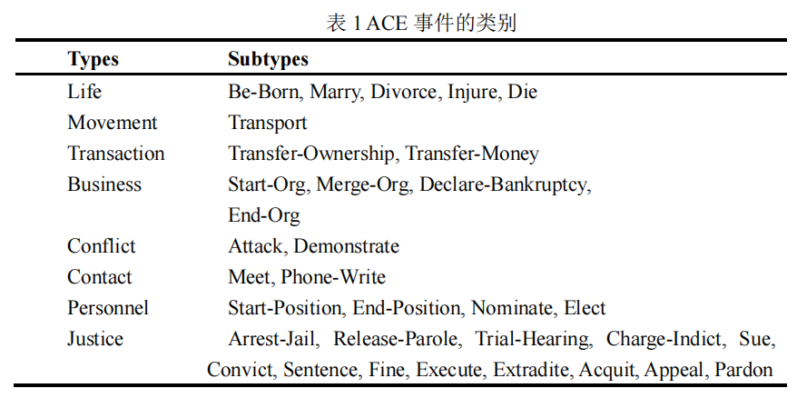
    

上图给出了 ACE 2005 中定义的 Business 大类，Merge-Org 子类事件的一个详细描述的例子，“购并”是这类事件的一个触发词。该事件由三个元素组成，“雅虎公司”、“9 号”、“奇摩网站”分别对应着该类（Business/Merge-Org）事件模板中的三个角色标签，即：Org、Time-Within 以及 Org。

3. KG和事件图
    2012，Goggle提出KG，但是是静态的知识，也促进事件及其关系的研究。2014，Glava提出事件图，构造了文本中的事件信息，以满足对事件信息的高效检索和表示。在这个事件图中，节点是由触发器和自变量（主题、对象、时间和位置）组成的事件，边是事件时间关系。2015年，Glava又在此基础上添加了事件的共指关系。

4. 事理图谱

随着许多现实世界应用的发展，如事件预测、决策和对话系统的场景设计，人们需要了解事件的演变和发展。在2017年，李等人[27]提出了事件演化图。它类似于事件图[24]，但其事件节点是抽象的、广义的、语义完整的动词短语。它进一步考虑了事件的因果关系，揭示了事件的演化模式和发展逻辑。然后，在2018年，Gottschalk和Demidova[28]提出了以事件为中心的时态KG，其中事件、实体和关系是节点，以便于对网络、新闻和社交媒体上的当代和历史事件进行语义分析。其中的事件具有主题、时间和地理信息，并与参与事件的实体相关联。他们还考虑了事件之间的子事件、上一个事件和下一个事件的关系，以及实体-实体的关系。2019年，事件演化图被推导为事理图[29]，其中节点是抽象的、广义的和语义完整的事件元组。此外，还考虑了另外两种事件关系，条件关系和超类-子类关系。

## 本体视角

基本概念：事件模式描述了构成EKG的基本概念，包括事件类型、元素和关系

任务和方法：事件模式（event schema）、脚本、EKG模式归纳（EKG schema inductions）

### 事件模式归纳

由于手动设计的模式覆盖率低且领域适配困(如ACE提出的事件类型)，需要自动从文本中提取事件类型和其元素。

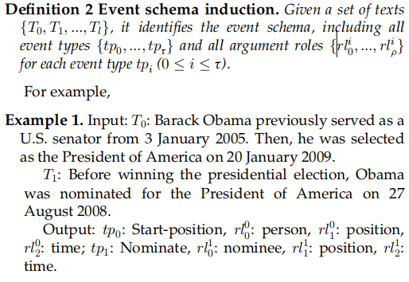

方法：
- 监督方法：从标注数据学习
- 半监督方法：少量标注数据
- 无监督方法：不使用标注数据，通过表示学习归纳事件模式

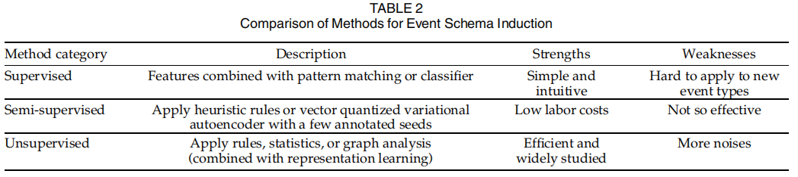

### 脚本归纳

脚本可以被看作是事件模式的一种定型结构，它表达了一个特定的场景。具体来说，它将一组事件组织成某种结构（通常根据它们的时间关系）。脚本中的“事件”称为脚本事件，是事件模式，而不是实例。

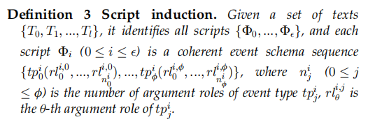

主要挑战是自动学习特定情境的要素角色。脚本可以看作是关于事件的规则，在特定的场景中形成事件的演变模式。它的一个基本应用是通过脚本事件预测来预测未来会发生什么。具体来说，已知的真实世界事件被概括为脚本事件。然后，它们被用来派生后续的脚本事件，称为脚本事件预测。最后，可以将预测的后续脚本事件实例化为真实世界的事件。

### EKG模式归纳

已有研究相对较少，2020年，李等人[66]首次研究了事件图模式归纳，重点研究了丰富的事件组件和事件-事件连接。提出了一种路径语言模型来构建事件图模式库，其中两种事件类型通过事件-事件路径连接，事件-事件-路径涉及扮演重要要素角色的实体。这些实体被它们的类型所取代。然而，这项工作只关注事件之间的联系。2021年，李等人[67]进一步关注了所有三种类型的关系，即事件-事件、事件-实体和实体-实体关系。他们将模式视为指导事件图生成的隐藏知识，并通过最大化这些实例图的概率来学习。然而，对于事件间的关系，只考虑了时间关系。一般来说，现有的关于EKG只考虑有限的关系类型。

## 实体视角

### 事件获取

1. 事件提取

主要从文本中提取结构化的事件信息，包括具有事件类型的触发器和具有角色的要素。两个子任务：触发器检测和要素提取。触发器检测主要区分事件触发词，并赋予它们预定义的类型或者聚类类别。要素提取用于区分要素，并赋予它们触发事件的要素角色。

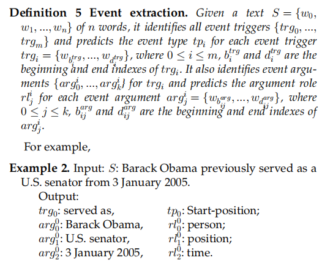

事件提取根据是否有预定义的规则分为基于模式的和无模式的方法。基于模式的方法将文本传递给特征学习器，以获得局部（和全局）特征。基于它们，触发器和要素的分类器输出预定义模式上的概率分布，以得到具体类别。对于无模式事件提取，将文本传递给判别器以获得原始触发器和要素，这些触发器和要素被聚类成组以诱导事件模式并获得答案。其中通常使用简单的无监督事件模式归纳方法（见第3.1节）。具体来说，考虑到输入规模，基于模式的事件提取进一步分为句子和文档级别的事件提取，无模式事件提取也称为开放域事件提取。与文档级和开放域事件提取相比，句子级的研究更为广泛。

- 句子级别的事件提取

根据特征维度，又分为子任务内的（ intra-subtasks）、子任务间的（inter-subtasks）以及信息提取任务内的（ inter-IE features）三种。

- 文档级别的事件提取

句子级事件提取假设事件触发器及其要素在同一个句子中。然而，在现实世界中，它们通常分散在文档中的多个句子中。因此，文档级事件提取是实用的。这也更具挑战性，因为要素可能存在于不同的句子中，并且一份文件通常包含多个事件。

- 开放领域的事件提取

与句子和文档级别的事件提取不同，开放域没有预定义的模式。它主要从新闻专线等长文本和社交媒体流等短文本中提取事件。

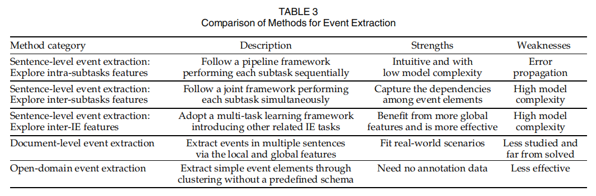

总之，尽管事件提取已经研究了很长时间（见表3），但其性能并不令人满意，尤其是在要素提取方面。因此，它可能会将噪声引入EKG构造中。此外，部分由于要素提取的性能较低，一些关于EKG应用程序的研究，如脚本事件和时态KG预测，只考虑了简单的固定要素角色、主体、对象和间接对象或时间，而没有考虑定义明确的复杂模式。因此，提高这个主要事件提取任务的性能是非常重要的。

2. 事件关系提取

除事件提取外，事件关系提取也是EKG构建的基础。它从文本中提取事件之间的关系，并链接事件以获取EKG。

主要的事件关系是事件时间和因果关系。事件时间关系描述了事件间的时间顺序，事件因果关系是事件时间关系的子集。

早期方法依赖于人工设计的句法和语法特征，最近的方法利用神经网络学习有用的特征来实现提取。同时，预训练模型在NLP任务上表现好，BERT等模型也被用于事件关系提取。通常，现有的事件关系提取方法（见表4）不能完全满足EKG构建的要求。例如，他们通常只关注作为事件的动词，而不考虑名词。事实上，事件触发器可以是动词也可以是名词。另一个限制是他们忽略了要素。未来事件关系提取的研究应该关注这些基本问题。

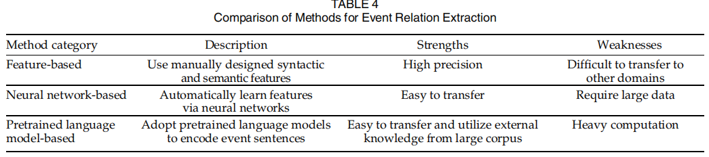

3. 事件共指消解

通常有许多文本描述相同的事件。在事件提取之后，有必要将涉及同一现实世界事件的事件分组到同一集群中。此任务称为事件共指消解。根据事件来自同一文档还是不同文档，事件共引用解析分为文档内设置和跨文档设置。后者更为复杂，因为很难处理来自不同文档的事件上下文。例如，来自不同文档的语义相似的事件上下文可以描述不同的事件。现有方法将事件提取的结果及其上下文传递给特征学习器和共指评分器，以获得事件之间的共指结果。已有方法可以分为无监督、半监督和有监督

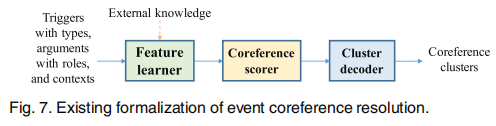

- 无监督：构建基于特征模板的事件表示，并采用模式匹配或无监督概率模型来识别共指关系
- 半监督：半监督方法关注现有注释语料库的稀缺性。他们使用少量标记数据和大量未标记数据来进行事件共指解析。
- 有监督：随着MUC[18]、ACE[30]和ECB/EBC+[132]、[140]等数据集的构建，以及TAC-KBP事件评估任务[71]的开发，研究人员开发了许多有监督的事件共指解析方法。根据共指得分器的样本形式，又分为事件对和事件排序模型。事件对模型是比较常用和有影响力的。通过处理事件对并使用二分类来进行共指消解。事件排序模型同时处理给定事件之前提到的所有事件，即前因。他们被训练为首先对每个给定事件的第一个共指先行词进行排序。

总体而言，现有的事件共指关系仍存在一些不足。例如，大多数方法都指定所有事件都有固定的要素。但是，要素因事件而异。此外，有些方法只考虑文档内环境，而不能处理跨文档环境，而这两种方法对于更好地构建EKG都很重要。因此，未来的研究应该开发实用的方法

4. 事件要素补全

由于原始文本中有些信息不完整，提取到的事件的元素有可能会缺失。事件要素补全在于补全已有事件的要素或者要素的角色。

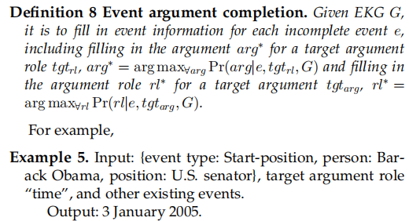

已有的方法将这个任务视为预测或者分类任务。

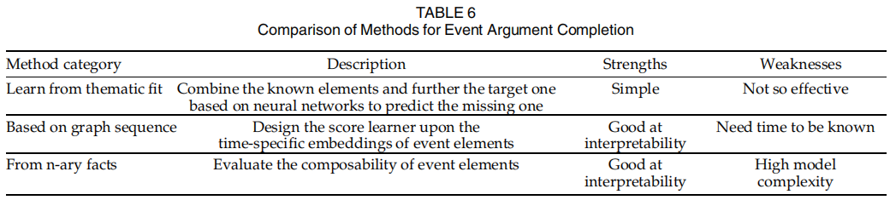

总体而言，现有的研究侧重于事件本身，而忽略了事件关系。引入事件关系可能会有所帮助。这是未来一个有趣的方向。此外，研究人员将事件要素补全简化为推断缺失的要素或要素角色。然而，要素角色及其要素通常都不存在。因此，未来的研究应该关注更贴近现实的方法。

### 关于EKG的表示图或者系统

- 特定领域的图谱或者系统
- 泛化领域的图谱或者系统

已有的方法都考虑了特定的、有限的事件-事件关系或要素角色。事实上，在现实世界的场景中存在各种事件-事件关系。此外，不同的事件通常不共享要素角色。有必要开发实用EKG，以促进未来的下游应用。

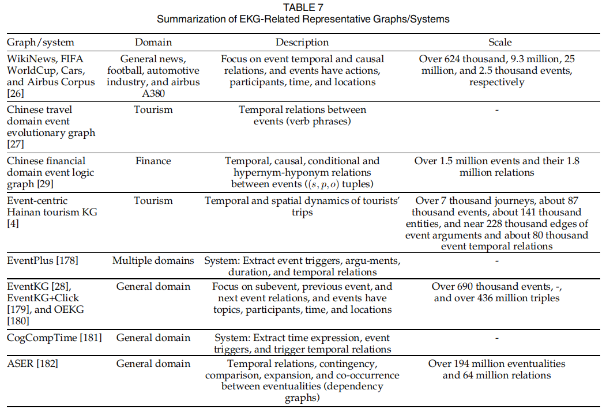

## 应用视角

### 基本应用

主要的基本应用是EKG预测，它基于当前EKG预测未来事件。有两种方法可以处理这些预测：脚本事件预测和时序KG预测。脚本事件预测将事件实例概括为脚本事件，并在脚本级别预测后续脚本事件，称为脚本事件预测。然后可以将预测的脚本事件实例化为真实世界的事件。时序KG预测直接在实例级别预测未来的事件。具体来说，现有的方法将EKG简化为时间KG，形式化为一系列的带有时间戳KG。然后，未来预测是预测未来时间戳的事件，称为时间KG预测。

1. 脚本事件预测

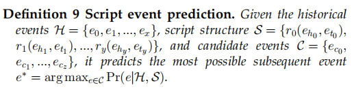

2. 时序KG预测

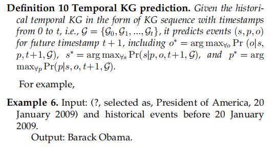

通常，现有的时态KG预测方法通常关注具有三个要素（即主语、对象和时间）的事件，并在给定未来事件的其他元素的情况下进行要素或谓词预测。因此，存在若干挑战。例如，如何用各种要素对历史事件进行建模？如何从整体上实际预测未来的事件？

3. 其它应用

也有对EKG的直接分析，如时间线生成和溯因推理。例如，Gottschalk和Demidova[210]使用以多语言事件为中心的时态KG-EventKG[28]生成了跨语言事件时间线。对于查询实体或事件，他们依赖EventKG来提供有关事件流行度以及事件与查询之间的关系强度的信息3。Gottschalk和Demidova[211]以及Gottschalk和Demidova[212]处理了传记时间线的生成。对于每个儿子的查询，他们根据事件流行度、关系强度和谓词标签从EventKG中提取了最相关的传记数据4。Du等人[213]提出了一种基于可变自动编码器的事件图增强预训练语言模型，用于溯因推理，该模型为观察到的事件找到了最合理的可解释事件。

### 深度应用

EKG可以进一步促进许多下游应用程序，如搜索、问答、推荐、金融量化投资和文本生成。例如，Rudnik等人[1]开发了一种基于事件的搜索引擎5，能够查询KGs和新闻文章。具体来说，他们将新闻文章中描述的事件映射到Wikidata[214]中的事件，并使用Wikidata中的属性来注释新闻文章。然后，他们构建了一个面向事件的KG和一个基于事件的搜索引擎。杨等[2]实现了中医临床诊疗的时态语义检索系统。它由离线部分和在线部分组成。前者是关于时态KG的构造、存储和索引，后者是关于搜索语句的理解、转换和执行。Souza Costa等人[3]解决了以事件为中心的问题，并基于以事件为核心的时态KG-EventKG[28]构建了第一个以事件为基础的问答数据集。吴等人[4]提出了一种基于GCN的兴趣点（POI）推荐方法，该方法结合了从事件中心旅游KG获得的游客行为模式，以有效地捕捉用户与POI之间的关系。Cheng等人[5]提出了一个基于KG的金融量化投资事件嵌入框架，其中学习的嵌入被馈送到下游量化交易方法中。基于该框架开发了一个移动迷你应用程序和一个基于Web的桌面平台，获得了巨大的累积投资组合回报。Colas等人[6]专注于图到文本的生成，以用户友好的方式更好地服务于图中的结构化信息。对于EventKG的每一个事件，他们都使用Wiki数据中的额外信息来增强数据，并将事件链接到维基百科页面以生成文本。

## 未来方向

1. 高性能事件获取

最近的事件获取研究在有效性和效率方面远远不能满足应用要求。特别是，事件和事件关系提取的精度较低。因此，它阻碍了高质量EKG的构建。此外，现有的模型通常不关注复杂性问题。然而，高参数和时间复杂性的模型不利于从海量数据中快速构建EKG。因此，高效和高效的事件获取是未来的一个重要方向。

2. 多模态知识处理

事件以文本、图像、音频和视频的形式呈现在现实世界中。然而，现有的EKG研究通常对文本进行处理，忽略了其他形式的信息。很少有研究涉及多模态事件表示学习[215]和提取[216]。事实上，不同形式的事件是相互消歧和互补的。因此，联合使用多模态信息非常重要。具体来说，来自所有模态的事件都应该在一个统一的框架中表示，事件获取应该处理多模态提取，EKG上的推理应该考虑多模态信息。

3. 可解释性EKG研究

现有的EKG研究主要应用深度学习方法来拟合训练数据。然而，它们通常缺乏可解释性，即对它们为什么以及如何工作没有明确的想法。事实上，了解最终结果的原因对于在实际应用中采用它们是有用的。解释为什么最终结果是给定的结果是友好和令人信服的。在未来，可解释性EKG的研究是一个重要的方向。

4. EKG实践

目前，EKG的相关任务和方法与现实世界的场景相去甚远。对于相关的任务，一些任务形式化是理想化的。例如，完成现有事件中的一个遗漏元素，通过从几个候选者中选择来预测未来的脚本事件，并预测未来事件的一个元素。在更实际的形式化下进行研究具有重要的应用意义。对于EKG的方法，GNN被广泛使用。然而，由于简化了任务和数据集，这些方法在EKG上使用了类似于在KG上的GNN（例如，[65]和[204]）。实际上，EKG由事件、实体及其关系组成。因此，未来的方法应该关注带参数的事件的原子性，以及事件之间和实体之间的关系。

