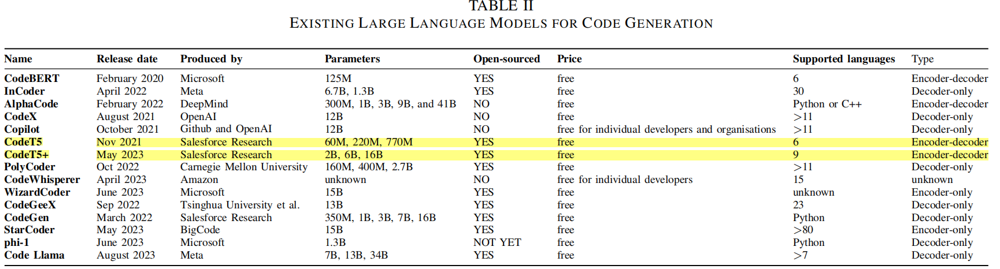

# 大模型在软件工程中的应用：综述和开放问题

LLM的输出不需要仅仅局限于代码，还可以包括其他软件工程人工制品，如需求、测试用例、设计图和文档。一般来说 ，LLM基于语言的本质，允许它生成任何语言定义的软件工程人工制品。

## LLM问题

- **幻觉问题**。大模型（LLM）应用到软件工程（SE）领域同样存在幻觉问题，幻觉意味着LLM产生的内容有可能不正确，可能引入bug。但是SE不像其它领域，软件工程师可以通过软件执行结果评估软工制品，同时在社区已经积累了很多专家经验，这对解决幻觉问题可能有帮助。
- **不确定性**。LLM本质上是不确定性的，相同的提示在不同的推理执行上产生不同的答案(除非温度被设置为零，这通常被发现是次优的 在多次执行上)。此外，不管温度设置如何，提示中的细微变化可能导致非常不同的输出。如果每次运行的结果都不同，那么如何确定所提出的技术是否取得了最先进的进步。

## LLM

### 分类

- Encoder. BERT from Google, RoBERTa from Meta
- Decoder. GPT from OpenAI, LLaMA from Meta, Claude from Anthropic, and PaLM from Google
- Encoder-Decoder. T5 from Google, BART from Meta

### LLM4SE

## Requirements engineering and Design

需求工程在LLM4SE中关注较少，已有研究集中在需求检索、分类上。可能的研究方向：因为需求通常是用自然语言编写的，可以使用LLM，识别需求和其他工程制品（代码、测试）之间的可追溯性联系。

## Code generation and completion

1. 代码生成

2. 提示工程用于提升代码生成性能

3. LLM和已有软件工程技术的混合
4. 科学评估
5. 已有问题：如何利用自动化软件测试来评估生成代码，代码执行能够验证幻觉问题，能够作为交互式推理/动作对话（Resoning/Action, ReAct）的一部分。如何有效微调LLM使其在特定语言上表现更好？如何对LLM生产的代码进行解释？

## Software testing

软件测试是一门成熟的研究学科，主要重点是自动生成测试套件，以发现缺陷。

综述：J. Wang, Y. Huang, C. Chen, Z. Liu, S. Wang, and Q. Wang, “Software testing with large language model: Survey, landscape, and vision,” 2023, arXiv:2307.07221.

### Generating New Tests Using LLMs

只使用LLM生成的测试代码大约四分之一可以执行，同时代码覆盖率也有所提升。

将LLM和已有的测试生成和评估技术进行结合的方法表现不错，如基于模糊的测试和基于搜索的测试。

Search-based test: CODAMOSA[105]

Fuzz-based test: ChatFuzz[106] TitanFuzz[109] FuzzGPT[110]

Mutation test: [107] [108]

Differential testing: [111]

GUI testing: [112]

User reports testing: Libro[113] [114]

Prompt engineering: [115] [116]  [117]

[105] C. Lemieux, J. P. Inala, S. K. Lahiri, and S. Sen, “CODAMOSA: Escaping Coverage Plateaus in Test Generation with Pre-trained Large Language Models,” 2023.

[106] J. Hu, Q. Zhang, and H. Yin, “Augmenting greybox fuzzing with generative ai,” 2023, arXiv:2306.06782. [107] A. Moradi Dakhel, A. Nikanjam, V. Majdinasab, F. Khomh, and M. C. Desmarais, “Effective test generation using pre-trained large language models and mutation testing,” arXiv e-prints, pp. arXiv–2308, 2023.

[108] C. S. Xia, M. Paltenghi, J. L. Tian, M. Pradel, and L. Zhang, “Universal fuzzing via large language models,” arXiv preprint arXiv:2308.04748, 2023. 

[109] Y. Deng, C. S. Xia, H. Peng, C. Yang, and L. Zhang, “Large Language Models are Zero-Shot Fuzzers: Fuzzing Deep-Learning Libraries via Large Language Models,” Mar. 2023, arXiv:2212.14834. 

[110] Y. Deng, C. S. Xia, C. Yang, S. D. Zhang, S. Yang, and L. Zhang, “Large Language Models are Edge-Case Fuzzers: Testing Deep Learning Libraries via FuzzGPT,” Apr. 2023, arXiv:2304.02014. 

[111] T.-O. Li, W. Zong, Y. Wang, H. Tian, Y. Wang, and S.-C. Cheung, “Finding Failure-Inducing Test Cases with ChatGPT,” Apr. 2023, arXiv:2304.11686.

[112] W. Sun, C. Fang, Y. You, Y. Miao, Y. Liu, Y. Li, G. Deng, S. Huang, Y. Chen, Q. Zhang, H. Qian, Y. Liu, and Z. Chen, “Automatic code summarization via ChatGPT: How far are we?” 2023, arXiv:2305.12865. 

[113] S. Kang, J. Yoon, and S. Yoo, “Large language models are fewshot testers: Exploring llm-based general bug reproduction,” in 2023 IEEE/ACM 45th International Conference on Software Engineering (ICSE), 2023, pp. 2312–2323. 

[114] “Prompting is all you need: Automated Android bug replay with Large Language Models,” in 46th International Conference on Software Engineering (ICSE 2024), April 2024, to appear. 

[115] Z. Yuan, Y. Lou, M. Liu, S. Ding, K. Wang, Y. Chen, and X. Peng, “No more manual tests? evaluating and improving chatgpt for unit test generation,” 2023, arXiv:2305.04207. 

[116] M. Sch¨afer, S. Nadi, A. Eghbali, and F. Tip, “Adaptive Test Generation Using a Large Language Model,” Feb. 2023, arXiv:2302.06527. 

[117] Z. Xie, Y. Chen, C. Zhi, S. Deng, and J. Yin, “ChatUniTest: a ChatGPT-based automated unit test generation tool,” May 2023, arXiv:2305.04764.

### Test Adequacy Evaluation

测试有效性通常以“充分性标准”来衡量。由于测试不能详尽地探索每一种可能性，充分性标准提供了一种下界的形式来衡量测试的有效性。突变测试（mutation, 变异、蜕变）是一种被广泛研究的技术，用于评估软件测试套件的充分性，通过故意注入变异体以评估测试的充分性。突变检测已被证明提供了更严格的结构性标准的充分性标准 信息和分支覆盖。突变测试的一个难点是如何生成能模拟真实世界错误的变异体[126-128]。

[126] A. Khanfir, R. Degiovanni, M. Papadakis, and Y. L. Traon, “Efficient mutation testing via pre-trained language models,” arXiv preprint arXiv:2301.03543, 2023. 

[127] A. Garg, R. Degiovanni, M. Papadakis, and Y. L. Traon, “Vulnerability Mimicking Mutants,” Mar. 2023, arXiv:2303.04247. 

[128] A. E. I. Brownlee, J. Callan, K. Even-Mendoza, A. Geiger, C. Hanna, J. Petke, F. Sarro, and D. Sobania, “Enhancing genetic improvement mutations using large language models,” in SSBSE 2023: Challenge Track. San Francisco, USA: Springer, 8 Dec 2023, to appear.

### Test Minimisation

测试最小化，通过消除冗余的测试用例来提高测试的效率。[129]

### Test Output Prediction

测试输出预测，提前预测测试用例执行的结果或输出的技术。通过分析软件的代码、历史测试数据或应用机器学习等方法，测试输出预测旨在提高测试效率，帮助测试人员或自动化测试工具更有效地识别潜在的错误或问题区域，从而优化测试资源的分配和使用。[129]

[129] R. Pan, T. A. Ghaleb, and L. Briand, “LTM: Scalable and Black-box Similarity-based Test Suite Minimization based on Language Models,” arXiv prnote arXiv:2304.01397, 2023.

### Test Flakiness

“测试波动性”或“测试不稳定性”。这指的是在软件测试过程中，相同的测试用例在不同的执行中可能会产生不一致的结果（即，有时通过，有时失败），而这种不一致并非由代码变更引起。测试波动性可能由多种因素引起，包括测试环境的不稳定、并发问题、时间依赖错误等，它会对测试的可靠性和软件质量的评估造成影响。[131-134]

[131] M. Harman and P. O’Hearn, “From start-ups to scale-ups: Opportunities and open problems for static and dynamic program analysis (keynote paper),” in 18th IEEE International Working Conference on Source Code Analysis and Manipulation (SCAM 2018), Madrid, Spain, September 23rd-24th 2018, pp. 1–23. 

[132] A. Akli, G. Haben, S. Habchi, M. Papadakis, and Y. Le Traon, “FlakyCat: Predicting flaky tests categories using few-shot learning,” in 2023 IEEE/ACM International Conference on Automation of Software Test (AST), 2023, pp. 140–151. 

[133] S. Fatima, T. A. Ghaleb, and L. Briand, “Flakify: A black-box, language model-based predictor for flaky tests,” IEEE Transactions on Software Engineering, 2022.

[134] S. Fatima, H. Hemmati, and L. Briand, “Black-box prediction of flaky test fix categories using language models,” 2023, arXiv:2307.00012.

###  Open problems in LLMs for Software Testing

1. 提示工程。如何设计提示？

   - 预测并减少生成的测试偏差；
   - 揭示可能的故障，例如通过历史故障数据的训练；
   - 优化模拟和集成测试之间的平衡；
   - 实现真实的数据构建器、模拟对象、参数和输入；
   - 预测最有可能引发覆盖边界情况的测试；
   - 定制测试生成，以关注产品中普遍存在的行为

2. 增强现有测试技术。使用few-shot和fine-tune，以生成额外的测试断言，利用可用的训练数据，捕获边界情况、历史错误和可能的程序员错误。

3. 测试正确性：传统的软件测试生成存在Oracle问题（如何确定测试结果是否正确），即它们受制于缺乏一个自动化的预言机来确定测试结果是否正确。评估基于LLM的软件测试

4. 突变测试。利用大模型微调故障模型，推荐与真实错误高度相关的变异体。

## Maintenance, Evolution and Deployment
### Debugging

Fault localisation.[140-145]

[140] S. Kang, G. An, and S. Yoo, “A preliminary evaluation of llm-based fault localization,” arXiv preprint arXiv:2308.05487, 2023. 

[141] Y. Wu, Z. Li, J. M. Zhang, M. Papadakis, M. Harman, and Y. Liu, “Large language models in fault localisation,” 2023, arXiv:2308.15276. 

[142] S. Feng and C. Chen, “Prompting Is All Your Need: Automated Android Bug Replay with Large Language Models,” Jun. 2023, arXiv:2306.01987. 

[143] H. Joshi, J. C. Sanchez, S. Gulwani, V. Le, G. Verbruggen, and I. Radiˇcek, “Repair is nearly generation: Multilingual program repair with LLMs,” in Proceedings of the AAAI Conference on Artificial Intelligence, vol. 37, no. 4, 2023, pp. 5131–5140. 

[144] Y. Wu, Z. Li, J. M. Zhang, and Y. Liu, “Condefects: A new dataset to address the data leakage concern for llm-based fault localization and program repair,” arXiv preprint arXiv:2310.16253, 2023. 

[145] E. Mashhadi, H. Ahmadvand, and H. Hemmati, “Method-level bug severity prediction using source code metrics and llms,” 2023.

###  Program Repair

自动修复的许多工作使用了在基因改良领域广泛采用的生成和测试方法，很容易结合LLM。但是大模型的幻觉和可扩展性仍需解决。为了实现可扩展性，所有的生成-测试方法都需要解决构建时间问题。基于LLM的修复也不例外；使用ReAct部署模型将有助于找到高效和有效的工程折中方案。当将ReAct应用于修复时，整个方法将在“推理”阶段（生成候选修复方案）和“行动”阶段（通过测试评估修复方案，这涉及到构建问题）之间交替进行。

AlphaRepair [153-154]

 LLM and a Completion Engine [155]

Conversational model of prompt engineering [156] ChatRepair [157] SELF-DEBUGGING [158]

Particular classes of bugs: [159-161]

Natural language description: [162]

Finetuning: [163-167]

Explanation: [168-169]

[46] C. L. Goues, M. Pradel, and A. Roychoudhury, “Automated program repair,” *Communications of the ACM*, vol. 62, no. 12, pp. 56–65, 2019.

[153] C. S. Xia and L. Zhang, “Less training, more repairing please: revisiting automated program repair via zero-shot learning,” in Proceedings of the 30th ACM Joint European Software Engineering Conference and Symposium on the Foundations of Software Engineering, 2022, pp. 959–971. 

[154] C. S. Xia, Y. Wei, and L. Zhang, “Practical program repair in the era of large pre-trained language models,” 2022, arXiv:2210.14179. 

[155] Y. Wei, C. S. Xia, and L. Zhang, “Copiloting the Copilots: Fusing Large Language Models with Completion Engines for Automated Program Repair,” in FSE 2023, 2023.

[159] H. Pearce, B. Tan, B. Ahmad, R. Karri, and B. Dolan-Gavitt, “Examining zero-shot vulnerability repair with large language models,” 2022, arXiv:2112.02125. 

[160] Y. Charalambous, N. Tihanyi, R. Jain, Y. Sun, M. A. Ferrag, and L. C. Cordeiro, “A new era in software security: Towards self-healing software via large language models and formal verification,” arXiv preprint arXiv:2305.14752, 2023. 

[161] J. Cao, M. Li, M. Wen, and S.-c. Cheung, “A study on Prompt Design, Advantages and Limitations of ChatGPT for Deep Learning Program Repair,” Apr. 2023, arXiv:2304.08191. 

[162] S. Fakhoury, S. Chakraborty, M. Musuvathi, and S. K. Lahiri, “Towards Generating Functionally Correct Code Edits from Natural Language Issue Descriptions,” Apr. 2023, arXiv:2304.03816. 

[163] T. Ahmed, S. Ghosh, C. Bansal, T. Zimmermann, X. Zhang, and S. Rajmohan, “Recommending Root-Cause and Mitigation Steps for Cloud Incidents using Large Language Models,” Feb. 2023, arXiv:2301.03797. 

[164] N. Jiang, K. Liu, T. Lutellier, and L. Tan, “Impact of code language models on automated program repair,” 2023, arXiv:2302.05020. 

[165] M. Jin, S. Shahriar, M. Tufano, X. Shi, S. Lu, N. Sundaresan, and A. Svyatkovskiy, “InferFix: End-to-End Program Repair with LLMs,” Mar. 2023, arXiv:2303.07263. 

[166] B. Berabi, J. He, V. Raychev, and M. T. Vechev, “TFix: Learning to fix coding errors with a text-to-text transformer,” in Proceedings of the 38th International Conference on Machine Learning, ICML 2021, 18-24 July 2021, Virtual Event, ser. Proceedings of Machine Learning Research, M. Meila and T. Zhang, Eds., vol. 139. PMLR, 2021, pp. 780–791. 

[167] C. S. Xia, Y. Ding, and L. Zhang, “Revisiting the plastic surgery hypothesis via large language models,” in ASE 2023, 2023. 

[168] S. Kang, B. Chen, S. Yoo, and J.-G. Lou, “Explainable automated debugging via large language model-driven scientific debugging,” 2023, arXiv:2304.02195. 

[169] D. Sobania, A. Geiger, J. Callan, A. Brownlee, C. Hanna, R. Moussa, M. Zamorano Lopez, J. Petke, and F. Sarro, “Evaluating explanations for software patches generated by large language models,” in SSBSE 2023: Challenge Track, ser. LNCS. San Francisco, USA: Springer, 8 Dec 2023, to appear.

###  Performance Improvement

Genetic Improvement: 	一种将程序转化为更有效的版本的方法

Suggestion：使用大模型推荐该优化的代码：[178-182]

[178] A. Madaan, A. Shypula, U. Alon, M. Hashemi, P. Ranganathan, Y. Yang, G. Neubig, and A. Yazdanbakhsh, “Learning Performance￾Improving Code Edits,” Feb. 2023, arXiv:2302.07867. 

[179] S. Garg, R. Z. Moghaddam, C. B. Clement, N. Sundaresan, and C. Wu, “Deepdev-perf: a deep learning-based approach for improving 21 software performance,” in Proceedings of the 30th ACM Joint European Software Engineering Conference and Symposium on the Foundations of Software Engineering, 2022, pp. 948–958. 

[180] S. Kang and S. Yoo, “Towards objective-tailored genetic improvement through large language models,” 2023, arXiv:2304.09386. 

[181] S. Garg, R. Z. Moghaddam, and N. Sundaresan, “Rapgen: An approach for fixing code inefficiencies in zero-shot,” arXiv preprint arXiv:2306.17077, 2023. 

[182] Z. Chen, S. Fang, and M. Monperrus, “Supersonic: Learning to generate source code optimisations in c/c++,” arXiv preprint arXiv:2309.14846, 2023.

### Clone Detection and Re-use

[184-187]

[184] C. W. Krueger, “Software reuse,” ACM Computing Surveys (CSUR), vol. 24, no. 2, pp. 131–183, 1992. 

[185] Q. Huang, J. Zhu, Z. Li, Z. Xing, C. Wang, and X. Xu, “PCRChain: Partial code reuse assisted by hierarchical chaining of prompts on frozen copilot,” in 2023 IEEE/ACM 45th International Conference on Software Engineering: Companion Proceedings (ICSE-Companion), 2023, pp. 1–5. 

[186] M. Zakeri-Nasrabadi, S. Parsa, M. Ramezani, C. Roy, and M. Ekhtiarzadeh, “A systematic literature review on source code similarity measurement and clone detection: Techniques, applications, and challenges,” Journal of Systems and Software, p. 111796, 2023. 

[187] J. Zhao, Y. Rong, Y. Guo, Y. He, and H. Chen, “Understanding programs by exploiting (fuzzing) test cases,” arXiv prnote arXiv:2305.13592, 2023.

###  Refactoring

基于搜索的重构[188]，使用大模型重构代码提升代码质量 [75,83]

[75] R. A. Poldrack, T. Lu, and G. Beguˇs, “AI-assisted coding: Experiments with GPT-4,” Apr. 2023, arXiv:2304.13187.

[83] D. Noever and K. Williams, “Chatbots as fluent polyglots: Revisiting breakthrough code snippets,” 2023, arXiv:2301.03373.

### Open Problems in Maintenance and Evolution
- Open Problems in Performance Improvement. 不只是考虑执行时间，还要考虑一些非功能属性（电池消耗、内存占用）
-  Open Problems in Refactoring。从设计模式出发；API误用
## DOCUMENTATION GENERATION
代码摘要生成，已有的评估指标是词汇性的，需要评估更丰富的能力。ReAct有可能另辟蹊径[95]

[95] S. Yao, J. Zhao, D. Yu, N. Du, I. Shafran, K. Narasimhan, and Y. Cao, “ReAct: Synergizing reasoning and acting in language models,” 2023, arXiv:2210.03629.

##  SOFTWARE ANALYTICS AND REPOSITORY MINING

软件解析：从已有的软件人工制品中分析产生有益于程序员的东西

这方面基本没有利用大模型的，因为大模型是已经获得了仓库的知识的。

## HUMAN COMPUTER INTERACTION
## SOFTWARE ENGINEERING PROCESS
## SOFTWARE ENGINEERING EDUCATION
## CROSSCUTTING OPEN RESEARCH TOPICS
### Building and Tuning LLMs for SE

- 针对软件的独特属性在软工任务上进行调整

- 模型轻量化（Lora， 模型量化）增强可部署性 [231, 232]

[231] E. J. Hu, Y. Shen, P. Wallis, Z. Allen-Zhu, Y. Li, S. Wang, L. Wang, and W. Chen, “Lora: Low-rank adaptation of large language models,” 2021, arXiv:2106.09685.

[232] A. Polino, R. Pascanu, and D. Alistarh, “Model compression via distillation and quantization,” 2018, arXiv:1802.05668.

### The Need for Dynamic Adaptive Prompt Engineering and Parameter Tuning
### Hybridisation

混合

### Harnessing Hallucination

利用幻觉

###  Robust, Reliable, and Stable Evaluation
###  Thorough Testing
###  Handling Longer Textual Inputs
###  Less Well-covered Subdomains of Software Engineering